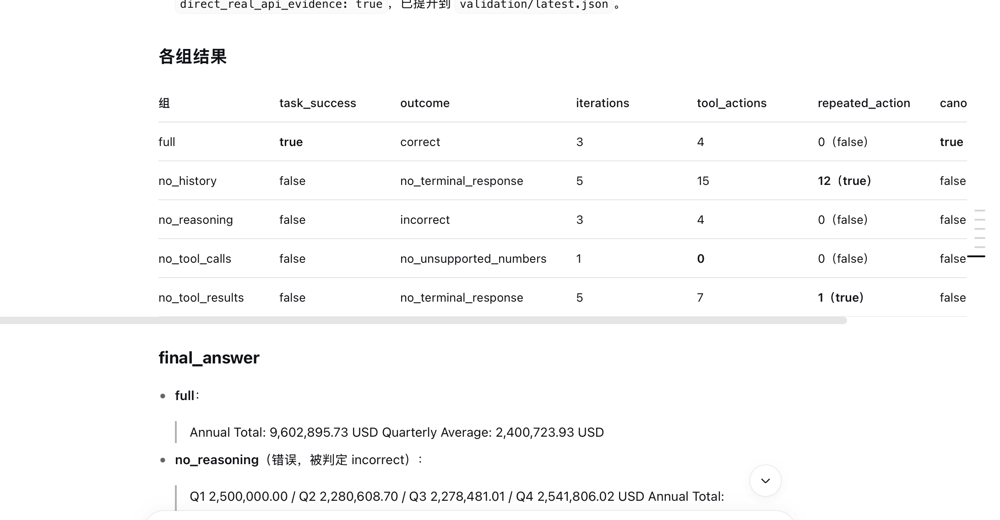
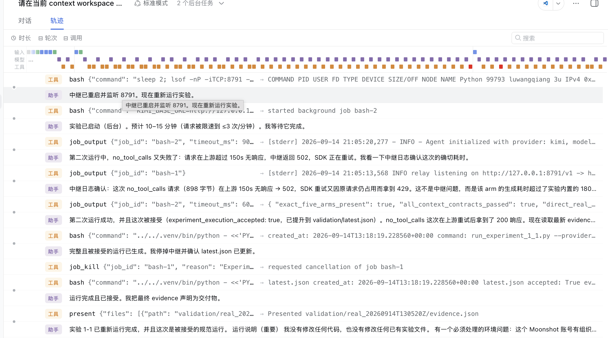
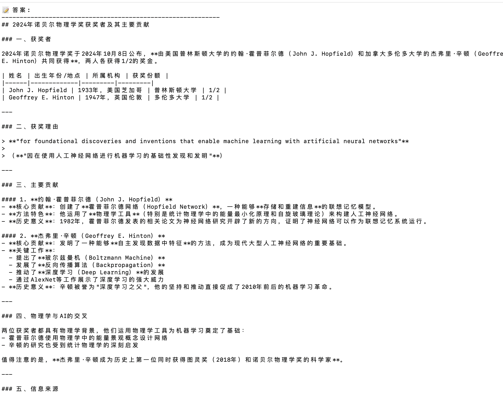

# Agent第一章学习
## Agent=LLM+上下文+工具
学了第一章后，我觉得Agent就是人的一个功能的体现，LLM是人的大脑，harness框架就是协调控制各个器官之间的一个制度，设计出一个好的体系，能够规避掉一些可能会出现错的情形。最后就是tools，

它主要是用来实现一开始的想法的，就比如一个人要吃饭，他就必须用电饭煲等把米煮熟再用其他东西放入嘴巴吃。当然，设计一个基础的agent就必须先考虑能完成最基础的功能，然后加上其他的个性化功能。

那么怎么知道想要完成的目标的呢？这就需要借助**上下文**来找到目标，它就像人的感受器官如眼睛等，功能就是识别任务。

## LLM是Agent的大脑
我的理解是，它有比较不错的推理能力和想象能力，能够理清楚想实现的任务的逻辑线，并且出错率比较低。类似于gpt、deepseek等，当然它也有不错的判断能力，知道哪些内容实际上可行、不可行。

## 上下文是Agent的眼睛
通过上下文识别到外部环境，后就能够使用LLM分析具体的分工任务。

### 5个构成部分
系统提示词（System Prompt）：与用户每次输入的提示词不同，系统提示词由开发者编写，在整个对话过程中保持不变，相当于 Agent 的“岗位说明书”——定义它的身份、权限和行为准则。

工具定义（Tool Definitions）：声明 Agent 可用工具的名称、功能描述和参数格式。没有工具定义，Agent 就无法识别和调用任何工具，但它并不会因此停下来——消融实验（实验 1-1）会说明这一点。工具定义与系统提示词一起构成对话中保持不变的静态前缀

用户消息（User Messages）：来自用户的输入。用户消息中还可能包含通过 RAG（检索增强生成，Retrieval-Augmented Generation，详见第三章）动态检索引入的外部知识——覆盖训练数据截止后的信息或私有领域知识。

模型回复（Assistant Messages）：模型之前生成的回复，最多包含三个部分——思考过程（reasoning，即内部思考链，用于保持思维的连贯性和决策的可解释性）、文本内容（content，即对用户的回复）和工具调用请求（tool_calls，即 Agent 采取行动的方式）。在一次具体的回复中，三者不一定同时出现：例如 Agent 决定调用工具时通常只有 reasoning + tool_calls，给出最终回答时通常只有 reasoning + content。

工具执行结果（Tool Results）：Agent 框架执行工具后返回的结果。这些结果是 Agent 下一步思考的直接依据，也让它能够从执行结果中学习、避免重复犯错。

## 工具是Agent的手脚

它负责把LLM给的任务完成落地。工具指 Agent 用来感知或改变外部世界的接口，包括工具定义、调用协议和适配器——从预定义的工具调用到动态生成代码，从委托子 Agent 协作到主动与用户沟通
他也会感知外部环境。

### 5类工具
感知工具让 Agent 能访问信息：搜索引擎提供实时网络数据，文件系统读取本地文档，API 和数据库则对接外部服务和企业核心数据。

执行工具让 Agent 改变世界：代码执行、文件操作、系统命令、外部 API 调用——决策由此变成实际行动。

协作工具让 Agent 与其他 Agent 分工合作：委托子 Agent 完成专项任务，在关键决策点请求人类确认，或在多 Agent 系统中协调行动。

事件触发工具 作为外部输入来驱动 Agent 开始执行任务。比如收到一封新邮件、到了某个预定时间点、或另一个系统发出了 Webhook 回调，这些事件会激活 Agent，让它开始后续的思考和行动。

用户沟通工具是 Agent 主动与用户建立连接、传递信息的渠道。与执行工具改变外部世界不同，用户沟通工具专注于信息的传递和交互——通过文字消息、语音通话、邮件等方式，将 Agent 的执行进展或主动关怀传达给用户。

## Harness是总管家
负责维护上下文到LLM再到工具端的协议，以及各个部门之间的协调工作，一个好的管家会让整体工作的运行效率翻倍。

## ReAct循环
类似人的行动，agent并不是一下子能够将大脑中的反应精准传到工具端实行，所有它会有ReAct循环去不断调整自己要完成的目标，特别重要的是会和环境反馈，不断调整知道能完成任务。

ReAct就是将 LLM、上下文和工具串联起来，不断和想要实现的目标靠近。

它就是将想-看-想-看……通过使用上面的上下文、工具等不断朝最终完成的结果缩小差距并达到满足的结果。

# 实验部分

## 1-1

这个是关于上下文的关键作用的实验，有完整的五个部分，最后的回答是比较不错的。本次实验用的是kimi-k2.6，去掉了思考部分，答案算错了。去掉了工具一直处于循环状态。还有等等情况，和书上说的一致。

这个地方展示的是根据deepseek harness展示出来LLM、上下文、工具内在部分交流的情况以及关于用户的反馈进行的调整。说明ReAct循环在agent中发挥重要作用。

## 1-2 

根据不断问ai，教我用api设置一些文件，然后最终显示出来确实可以达到能和人交流的结果。
## 1-3
这个地方采用的是qianwen3.7plus，找不到结果了，但的确是有相关能力

## 1-4

按照项目文件的代码，能从文字生成图片。

# 总体感受
学习这一章节的内容，一开始觉得内容太多了，不知道从哪开始学起，然后我就开始问问ai，先把大致讲的内容看懂。再跟着它带我做实验，感觉很麻烦，但是做完后有成就感。

认真做完这一章内容也非常费时间，因为我现在还需要看论文那些，时间对我来说就特别重要，希望能一直坚持下去，早日走出新手村。

